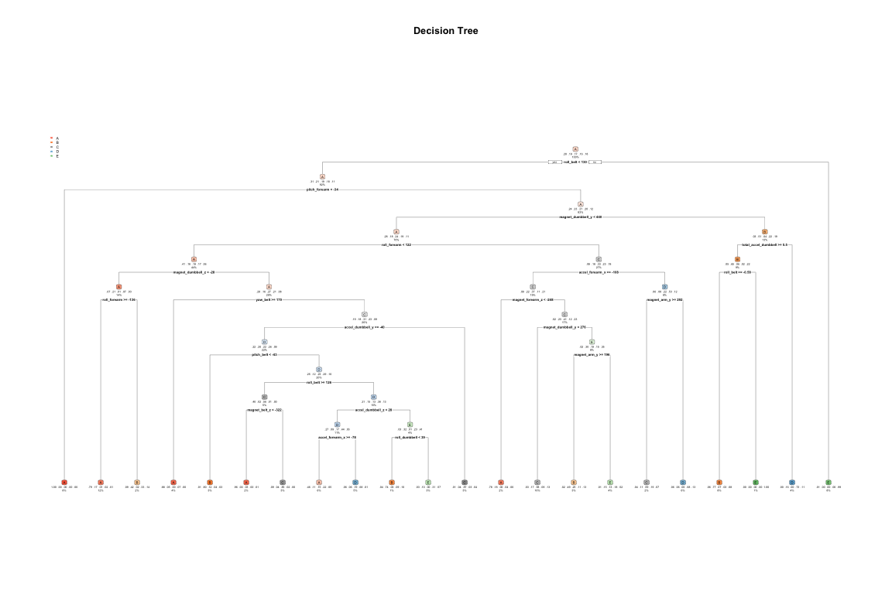
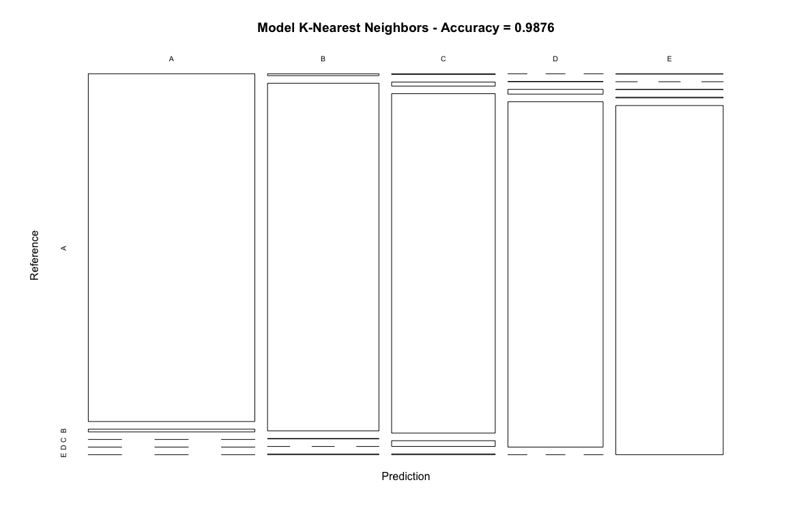

## 0. Background
Using devices such as Jawbone Up, Nike FuelBand, and Fitbit it is now possible to collect a large amount of data about personal activity relatively inexpensively. These type of devices are part of the quantified self movement – a group of enthusiasts who take measurements about themselves regularly to improve their health, to find patterns in their behavior, or because they are tech geeks. One thing that people regularly do is quantify how much of a particular activity they do, but they rarely quantify how well they do it. In this project, your goal will be to use data from accelerometers on the belt, forearm, arm, and dumbell of 6 participants. They were asked to perform barbell lifts correctly and incorrectly in 5 different ways. 

The goal of your project is to predict the manner in which they did the exercise.

### 0.1 The data

The training data for this project are available here:

https://d396qusza40orc.cloudfront.net/predmachlearn/pml-training.csv

The test data are available here:

https://d396qusza40orc.cloudfront.net/predmachlearn/pml-testing.csv


The data for this project come from this source: http://web.archive.org/web/20161224072740/http:/groupware.les.inf.puc-rio.br/har. 


## 1. The Analysis
The analysis includes an exploring data and cleaning, estimating best model for prediction and evaluating prediction erformances.

### 1.1 Setting general options and libraries


Uploading necessary libraries for R script

```r
library(caret) 
library(rpart)
library(ggplot2)
library(corrplot)
library(rpart.plot)
library(kknn)
Sys.setlocale(locale="en_US")
```

```
## [1] "en_US/en_US/en_US/C/en_US/it_IT.UTF-8"
```

Show system configuration for reproducibility

```r
R.version$platform
```

```
## [1] "x86_64-apple-darwin15.6.0"
```

```r
R.version$version.string
```

```
## [1] "R version 3.4.3 (2017-11-30)"
```

### 1.2 Upload and clean data

Loading "mtcars" data and review.

```r
traindata.url <- "https://d396qusza40orc.cloudfront.net/predmachlearn/pml-training.csv"
testdata.url <- "https://d396qusza40orc.cloudfront.net/predmachlearn/pml-testing.csv"
trainData <- read.csv(url(traindata.url), na.strings = c("NA", "", "#DIV0!"))
testData <- read.csv(url(testdata.url), na.strings = c("NA", "", "#DIV0!"))
```

Cleaning data set. In data frame are present columns with miltiple NA. All theese columns are dropped.

```r
#Eliminating NA column
trainData <- trainData[, colSums(!is.na(trainData))/dim(trainData)[1] > 0.5]
testData  <- testData [, colSums(!is.na(testData ))/dim(testData)[1] > 0.5]

#eliminating not usefull variables
trainData <- trainData[, -c(1:7)]
trainData$classe <- as.factor(trainData$classe) #classe variable to factor
testData <- testData[, -c(1:7)]
```

### 1.3 Pre-processing

Checking for zero-variance predictor

```r
nzv <- nearZeroVar(trainData, saveMetrics= TRUE)
nzv <- nearZeroVar(trainData)
```

NOTE: In this case nzv vector is empty.

Splitting the data

```r
inTrain <- createDataPartition(y=trainData$classe, p=0.7, list=F)
training.train <- trainData[inTrain, ]
training.test <- trainData[-inTrain, ]
dim(training.train)
```

```
## [1] 13737    53
```

```r
dim(training.test)
```

```
## [1] 5885   53
```

### 1.4 Model estimation (Decision Tree)

Estimating model (Decision Tree)

```r
decisionTree.Model <- rpart(classe ~ ., data = training.train, method = "class")
decisionTree.Prediction <- predict(decisionTree.Model, training.test, type = "class")
```

In the chart is visible the dendogram of the model

```r
rpart.plot(decisionTree.Model, main = "Decision Tree", under = T, faclen = 0)
```

<!-- -->

Let's see confusion matrix for model accuracy

```r
confusion.Matrix.mdldt <- confusionMatrix(decisionTree.Prediction, training.test$classe)
confusion.Matrix.mdldt
```

```
## Confusion Matrix and Statistics
## 
##           Reference
## Prediction    A    B    C    D    E
##          A 1519  194   59  115   25
##          B   58  659  100   88  106
##          C   36  153  762   80   90
##          D   41   77   74  547   54
##          E   20   56   31  134  807
## 
## Overall Statistics
##                                          
##                Accuracy : 0.7297         
##                  95% CI : (0.7181, 0.741)
##     No Information Rate : 0.2845         
##     P-Value [Acc > NIR] : < 2.2e-16      
##                                          
##                   Kappa : 0.6562         
##  Mcnemar's Test P-Value : < 2.2e-16      
## 
## Statistics by Class:
## 
##                      Class: A Class: B Class: C Class: D Class: E
## Sensitivity            0.9074   0.5786   0.7427  0.56743   0.7458
## Specificity            0.9067   0.9258   0.9261  0.95001   0.9498
## Pos Pred Value         0.7945   0.6518   0.6798  0.68979   0.7700
## Neg Pred Value         0.9610   0.9015   0.9446  0.91811   0.9431
## Prevalence             0.2845   0.1935   0.1743  0.16381   0.1839
## Detection Rate         0.2581   0.1120   0.1295  0.09295   0.1371
## Detection Prevalence   0.3249   0.1718   0.1905  0.13475   0.1781
## Balanced Accuracy      0.9070   0.7522   0.8344  0.75872   0.8478
```

```r
plot(confusion.Matrix.mdldt$table, col = confusion.Matrix.mdldt$byClass, 
     main = paste("Decision Tree - Accuracy =",
                  round(confusion.Matrix.mdldt$overall['Accuracy'], 4)))
```

<!-- -->

### 1.5 Model estimation (K-Nearest Neighbors)

Estimating model (K-Nearest Neighbors)

```r
kknn.Model <- train.kknn(classe ~ ., data = training.train, kmax = 9)
kknn.Prediction <- predict(kknn.Model, training.test)
```

Let's see confusion matrix for model accuracy

```r
confusion.Matrix.mdlkknn <- confusionMatrix(kknn.Prediction, training.test$classe)
confusion.Matrix.mdlkknn
```

```
## Confusion Matrix and Statistics
## 
##           Reference
## Prediction    A    B    C    D    E
##          A 1665   13    0    0    0
##          B    6 1113    1    0    2
##          C    2   12 1011   17    2
##          D    0    1   13  945    0
##          E    1    0    1    2 1078
## 
## Overall Statistics
##                                           
##                Accuracy : 0.9876          
##                  95% CI : (0.9844, 0.9903)
##     No Information Rate : 0.2845          
##     P-Value [Acc > NIR] : < 2.2e-16       
##                                           
##                   Kappa : 0.9843          
##  Mcnemar's Test P-Value : NA              
## 
## Statistics by Class:
## 
##                      Class: A Class: B Class: C Class: D Class: E
## Sensitivity            0.9946   0.9772   0.9854   0.9803   0.9963
## Specificity            0.9969   0.9981   0.9932   0.9972   0.9992
## Pos Pred Value         0.9923   0.9920   0.9684   0.9854   0.9963
## Neg Pred Value         0.9979   0.9945   0.9969   0.9961   0.9992
## Prevalence             0.2845   0.1935   0.1743   0.1638   0.1839
## Detection Rate         0.2829   0.1891   0.1718   0.1606   0.1832
## Detection Prevalence   0.2851   0.1907   0.1774   0.1630   0.1839
## Balanced Accuracy      0.9958   0.9876   0.9893   0.9887   0.9977
```

```r
plot(confusion.Matrix.mdlkknn$table, col = confusion.Matrix.mdlkknn$byClass, 
     main = paste("Model K-Nearest Neighbors - Accuracy =",
                  round(confusion.Matrix.mdlkknn$overall['Accuracy'], 4)))
```

<!-- -->

### 1.6 Model estimation (Random Forest)

Estimating model (K-Nearest Neighbors)

```r
randomForest.Model <- train(classe ~., method = "rf", data = training.train, verbose = FALSE, trControl = trainControl(method="cv"), number = 3)
randomForest.Prediction <- predict(randomForest.Model, training.test)
```

Let's see confusion matrix for model accuracy

```r
confusion.Matrix.mdlrf <- confusionMatrix(randomForest.Prediction, training.test$classe)
confusion.Matrix.mdlrf
```

```
## Confusion Matrix and Statistics
## 
##           Reference
## Prediction    A    B    C    D    E
##          A 1674    6    0    0    0
##          B    0 1125    8    0    0
##          C    0    8 1016   15    1
##          D    0    0    2  948    1
##          E    0    0    0    1 1080
## 
## Overall Statistics
##                                           
##                Accuracy : 0.9929          
##                  95% CI : (0.9904, 0.9949)
##     No Information Rate : 0.2845          
##     P-Value [Acc > NIR] : < 2.2e-16       
##                                           
##                   Kappa : 0.991           
##  Mcnemar's Test P-Value : NA              
## 
## Statistics by Class:
## 
##                      Class: A Class: B Class: C Class: D Class: E
## Sensitivity            1.0000   0.9877   0.9903   0.9834   0.9982
## Specificity            0.9986   0.9983   0.9951   0.9994   0.9998
## Pos Pred Value         0.9964   0.9929   0.9769   0.9968   0.9991
## Neg Pred Value         1.0000   0.9971   0.9979   0.9968   0.9996
## Prevalence             0.2845   0.1935   0.1743   0.1638   0.1839
## Detection Rate         0.2845   0.1912   0.1726   0.1611   0.1835
## Detection Prevalence   0.2855   0.1925   0.1767   0.1616   0.1837
## Balanced Accuracy      0.9993   0.9930   0.9927   0.9914   0.9990
```


```r
plot(confusion.Matrix.mdlrf$table, col = confusion.Matrix.mdlrf$byClass, 
     main = paste("Model Random Forest - Accuracy =",
                  round(confusion.Matrix.mdlrf$overall['Accuracy'], 3)))
```

<!-- -->


### 2.0 Conclusion
The model with highest level of accurancy is the random forest one, even if kknn as good level of acccurancy. We will use random forest for predict "classe" variable of testing set.


```r
predict.finalkn <- predict(kknn.Model, newdata=testData)
predict.finalkn
```

```
##  [1] B A B A A E D B A A B C B A E E A B B B
## Levels: A B C D E
```

```r
predict.finalrf <- predict(randomForest.Model, newdata=testData)
predict.finalrf
```

```
##  [1] B A B A A E D B A A B C B A E E A B B B
## Levels: A B C D E
```
